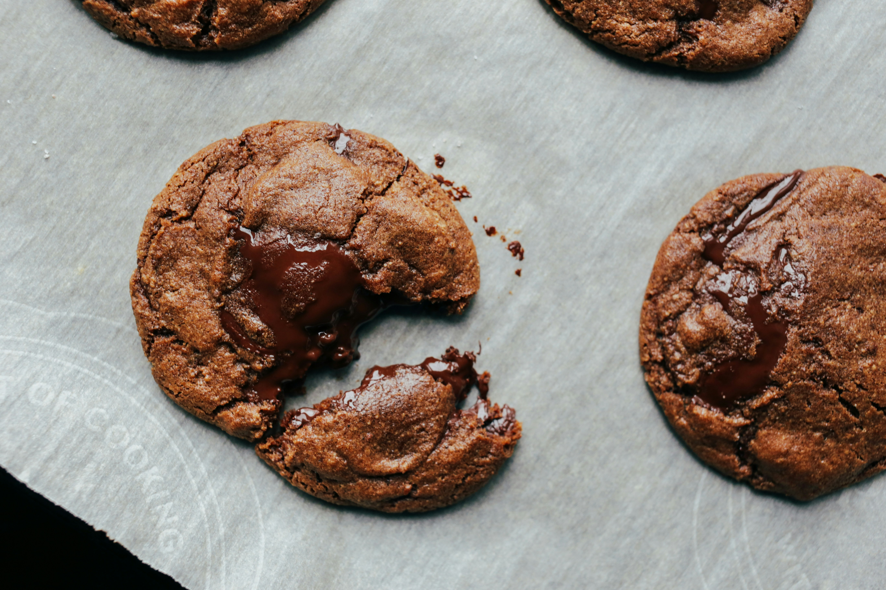

# Cookie Clicker Automation Script

This script automates gameplay for the web-based game [Cookie Clicker](https://orteil.dashnet.org/cookieclicker/) using Selenium WebDriver. It automatically clicks the cookie and buys available add-ons after specified intervals.


## Table of Contents
- [Features](#features)
- [Requirements](#requirements)
- [Installation](#installation)
- [Usage](#usage)
- [License](#license)

## Features

- Automatically clicks the main cookie button.
- Purchases unlocked add-ons at regular intervals.
- Tracks cookies per second before stopping.

## Requirements

- Python 3.x
- Selenium library
- Google Chrome browser

## Installation

1. **Install Python**: Download and install Python from [python.org](https://www.python.org/).

2. **Install Selenium**:
   ```bash
   pip install selenium
   
## Usage

1. Clone the repository or download the script to your local machine.
2. Open the script and modify the following parameters if necessary:
`click_time`: Set how long (in minutes) you want the script to run.
`buy_add_on_time`: Set how frequently (in seconds) you want to buy unlocked add-ons.

3. Run the script:
    ```bash
    python cookie_clicker_automation.py

Follow the on-screen prompts: The script will navigate to the Cookie Clicker website and begin automating gameplay.

Note that the script uses hard-coded sleep intervals (time.sleep()) to wait for elements to load. Adjust these as needed based on your internet speed and browser performance.
To stop the script, you can close the browser or interrupt the script execution.

## License

This project is licensed under the MIT License - see the LICENSE file for details.

