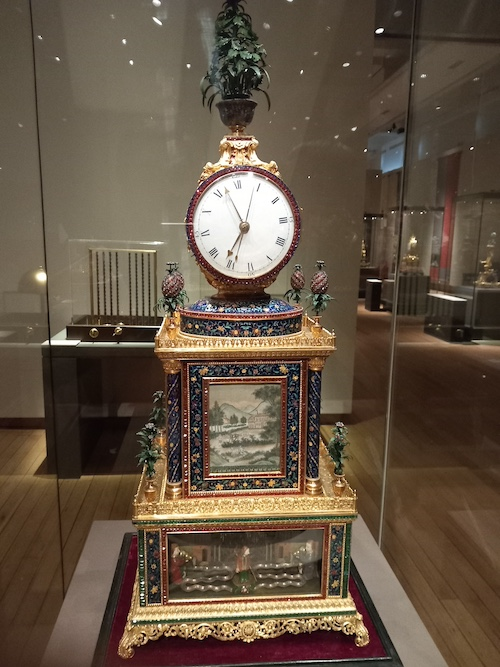

# PDF to Speech Converter

## Overview

This Python project converts any PDF document into speech, making it accessible to users who prefer audio content. The example PDF used for this project is the [**"Zimingzhong Exhibition"**](https://www.sciencemuseum.org.uk/what-was-on/zimingzhong), which provides a fascinating exploration of musical clocks from the Qing dynasty and their trade between Britain and China. I am a volunteer at the [Science Museum in London](https://www.sciencemuseum.org.uk/) and I had provided tours for this temporary exhibition. The PDF contains the text I preesented to visitors during the tours. The Python script in this repository allows you to convert this specific exhibition guide into speech, but it can be easily adapted to work with any other PDF as well.





## Objective

The goal of this project is to allow the text from the exhibition guide (or any other PDF) to be converted to speech, making it accessible for visually impaired individuals or for those who prefer listening over reading. The script extracts the text from the PDF and uses text-to-speech technology to play or save the audio.

### Example PDF Content (Used for Zimingzhong Exhibition):
- **Topic**: The Zimingzhong (self-ringing musical clocks) and their historical significance.
- **Key Sections**: 
  1. Introduction to Zimingzhong.
  2. History and trade of these clocks between Britain and China.
  3. The mechanics and tools used in making these intricate clocks.
  4. Symbolism and design elements present in the clocks.

This script works with **any PDF file**, not just the one used in this example.

## Requirements

To run this project, you need to install the following Python libraries:

- `gTTS`: Google Text-to-Speech library for converting text to audio.
- `pygame`: For playing audio files and controlling playback.
- `PyPDF2`: For extracting text from PDF files.

### Install Required Libraries

You can easily install these dependencies by running:

```bash
pip install -r requirements.txt
```

Here’s what should be in your `requirements.txt` file:

```
gTTS==2.2.4
pygame==2.5.0
PyPDF2==3.0.0
```

## How It Works

1. **Extracts Text from PDF**: The script uses `PyPDF2` to read and extract the text from the provided PDF file.
2. **Converts Text to Speech**: Using `gTTS`, the extracted text is converted into speech and saved as an audio file (in `.mp3` format).
3. **Plays Audio**: `pygame` is used to play the audio file, and you can control the playback by interrupting the console (using `Ctrl+C` to stop).

### Features:
- Convert any PDF into speech.
- Save the speech as an MP3 file for future playback.
- Control audio playback and stop it at any time.

## Usage Instructions

### Step 1: Prepare Your PDF

1. Place the PDF you wish to convert into the same folder as the script or provide the absolute path to the file.
   - **Example**: `your_pdf_file.pdf` (this could be the exhibition guide or any other PDF).

### Step 2: Run the Script

Run the following command in your terminal or command prompt to execute the script:

```bash
python pdf_to_speech.py
```

The script will:
1. Read the PDF, extract its text.
2. Convert the text to an MP3 file named `output_audio.mp3`.
3. Automatically play the generated MP3 file using `pygame`.

### Step 3: Stop Playback

You can stop the playback at any time by pressing `Ctrl + C` in your terminal. The script is designed to handle interruptions gracefully.

### Step 4: Check the Output

- The generated audio will be saved as `output_audio.mp3` in the current working directory.
- You can play the audio file with any media player, or re-run the script with different PDFs.

## Example Output

Assuming the PDF used is the **Zimingzhong Exhibition Guide**, the audio will narrate the following:

- Introduction to the Zimingzhong clocks.
- Details of their history, the significance of their trade between Britain and China.
- Exploration of the mechanics, tools, and intricate design features of these clocks.
- Information on the techniques and craftsmanship involved in making Zimingzhong.

## Customization

You can easily modify the script to handle any PDF by specifying the path of your PDF in the script. The following section needs to be updated:

```python
# Replace with the path to your PDF file
pdf_path = 'your_pdf_file.pdf'
```

You can also adjust the audio file's name and format in the script.

## Notes on the Zimingzhong Exhibition

The Zimingzhong (自鸣钟) are self-ringing musical clocks that have historical significance in both Britain and China. These clocks were popular during the Qing dynasty and were collected by emperors such as Kangxi, Yongzheng, and Qianlong. The Zimingzhong not only told the time but also played music and depicted moving scenes, representing both cultural exchange and technical mastery.

The **Zimingzhong Exhibition** guide delves into the mechanics, trade routes, tools, and symbols of these beautiful timepieces. The trade of these clocks between Britain and China was facilitated through the East India Company, crossing vast distances to reach the Chinese imperial court.

## Conclusion

This Python script provides an easy way to convert PDF documents into audio format, making them more accessible for people who prefer listening or for those with visual impairments. Whether you want to convert exhibition guides like this one or any other PDF, the script offers a simple solution to creating personalized audio versions of your favorite documents.

