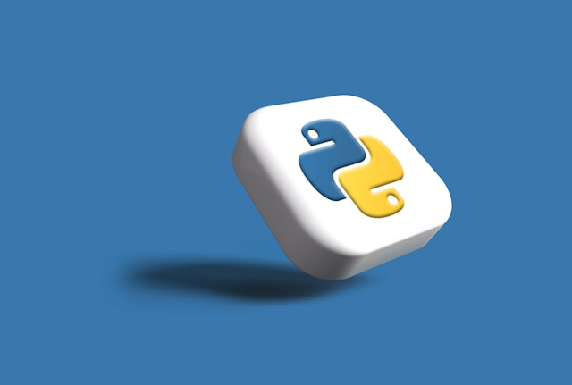

# 100 Days of Python Programs

This repository showcases some of the Python programs I wrote while doing the Udemy course [100 Days of Code: The Complete Python Pro Bootcamp](http://www.udemy.com/course/100-days-of-code/). I thank Angela Yu and her team for this excellent course and I would highly recommend it to anyone interested in learning and enhancing their coding skills in Python. Photos are taken from the [Unsplash website](https://unsplash.com).

## Topics Covered

- Python 3
- PyCharm, Jupyter Notebook, Google Colab
- Python Scripting and Automation
- Python Game Development
- Web Scraping
- Beautiful Soup
- Selenium Web Driver
- Request
- WTForms
- Data Science
- Pandas
- NumPy
- Matplotlib
- Plotly
- Scikit learn
- Seaborn
- Turtle
- Python GUI Desktop App Development
- Tkinter
- Front-End Web Development
- HTML 5
- CSS 3
- Bootstrap 4
- Bash Command Line
- Git, GitHub and Version Control
- Backend Web Development
- Flask
- REST
- APIs
- Databases
- SQL
- SQLite
- PostgreSQL
- Authentication
- Web Design
- Deployment with GitHub Pages, Heroku and GUnicorn

## Programs in this Repository

1) [Blackjack Game](Blackjack) - This program simulates a simple Blackjack game using Python and uses random number generation, conditional logic, recursive functions, and user input handling.
2) [Coffee Machine](Coffee-machine) - This program simulates a coffee machine operation using Python and uses object-oriented programming, user input handling, and resource management to manage orders and inventory.
3) [Cookie Clicker](Cookie-clicker) - This folder contains a Selenium automation script for Cookie Clicker and uses web scraping, browser automation, scheduling tasks, and handling web elements with Python.
4) [PDF to Audio Converter](PDF-to-Audio) - A Python script that extracts text from PDFs and converts it into speech using gTTS, pygame, and PyPDF2, with audio playback and saving functionality.

